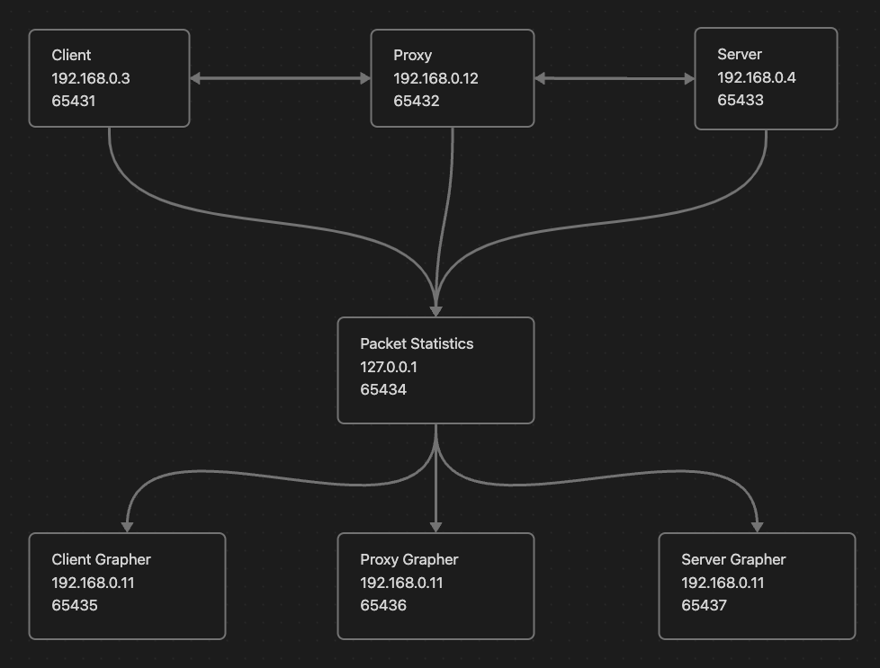

# Install packages

```
pip3 install -r requirements.txt
```

## Run Client

```
python3 client.py [Proxy IP] [Proxy Port]
```

## Run Proxy

```
python3 proxy.py [Proxy IP] [Proxy Port] [Server IP] [Server Port] [% DROP DATA] [% DROP ACK] [% DELAY DATA] [%DELAY ACK] [GUI IP Address]
```

## Run Server

```
python3 server.py [Server IP] [Server Port]
```

## Run Grapher

```
python3 gui_grapher.ph [IP Address] [Port]
```

# Visual Representation


